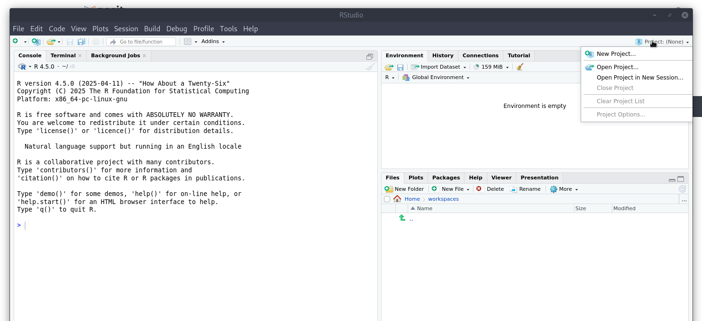
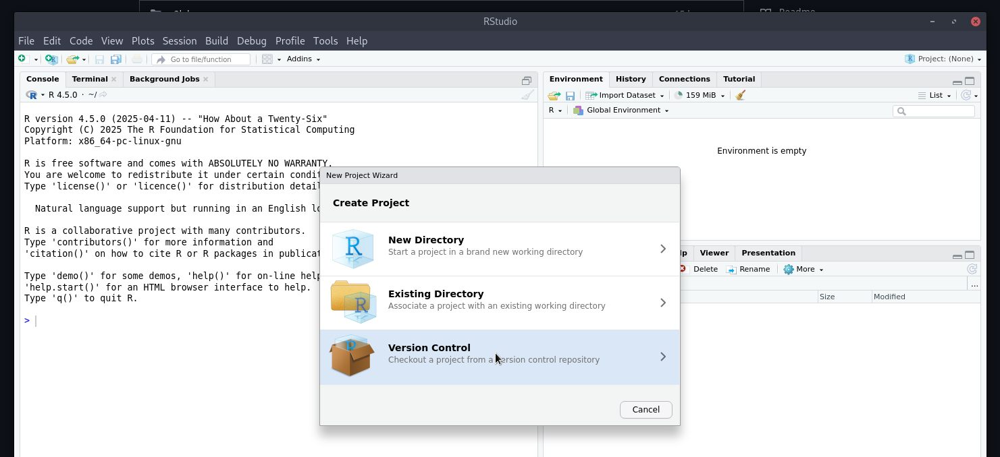

# Epidemiology 756: Intro to Infectious Disease Modeling and Simulation in R

## Installing These Materials

First, install Rstudio per [Intro Slides](https://docs.google.com/presentation/d/1_0eno21uN9Do_9H7i6LBPrlLSlV2x8rk/?slide=id.p9#slide=id.p9).

Then use Rstudio "New Project" capability to checkout this repository:

Step 4: then fill in the URL from this repository: https://github.com/ACCIDDA/epid756
